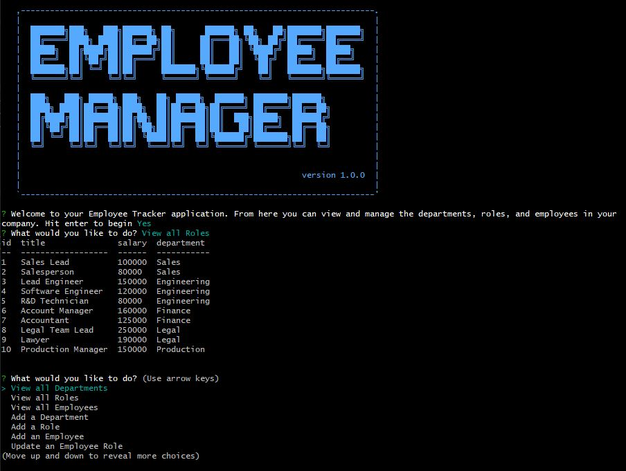

# Employee Tracker Node.js
  

  ## Description
  
  - This is my first homework assignment using MySQL for the Full Stack Web Developer course I'm enrolled in. The assigment was to create a content management systems (CMS) interface using Inquirer.js so a business owner can view, manage, and organize the departments, roles, and employees of his/her company.
  - By completing this assignment, I was able to implement lessons from my course, including:
    - Code JavaScript for a Node.js application,
    - Utilize several npm packages
    - Work with MySQL to create and manipulate a database
    - Establish Javascript modules to deploy the application
    - Run asynchronous queries
    - And finally use Inquirer.js for the user interface on the command-line.
  - See the Usage Information of this README for a link to a walkthrough video that demonstrates the appication's functionality.
  
  The following are screenshots of the final version of the application in the terminal and a sample HTML page generated by the command-line application. 

    
   
   
  ## Table of Contents
   
  - [Installation](#installation)
  - [Usage](#usage)
  - [Credits](#credits)
  - [License](#license)
  - [How To Contribute](#how_to_contribute)
  - [Tests](#tests)
  - [Questions](#questions)
  
  ## Installation
  
  To use this application, there are a few steps to folllow:
  1) Have [NODE.js](https://nodejs.org/en/download/) installed on your computer. 
  2) Clone my [GitHub](https://github.com/CM-GDev/EmployeeTracker_NodeJS) repo for this application.
  3) From the root of your project folder, run 'npm install' from the command-line to install the required npm packages for the application
  
  ## Usage
  
  After installing the items above, use this [Walkthrough](https://youtu.be/RPUgi_opX3w) video as a guide for using this application.
    
  ## Credits

  For this homework assignment, I relied on several articles/documentation:
  
  [Inquirer](https://www.npmjs.com/package/inquirer)  
  [MDN_Async_function](https://developer.mozilla.org/en-US/docs/Web/JavaScript/Reference/Statements/async_function)  
  [Node_mysql2_Documentation](https://github.com/sidorares/node-mysql2#readme)  
  [MySQL_Documentation](https://docs.oracle.com/en-us/iaas/mysql-database/doc/getting-started.html)  

  ## License
  
  MIT License

  Copyright (c) [2022] [Cristobal Marquez-Glynn]
  
  ## How to Contribute
  
  - [Contributor Covenant](https://www.contributor-covenant.org/) 
  - I'm open to suggestions on how to improve this product.
  
  ## Tests
  
  N/A
  
  ## Questions
   
  For any questions, you can reach me through my [GITHUB](https://github.com/CM-GDev) or email: cristobalmqz@gmail.com account. 
